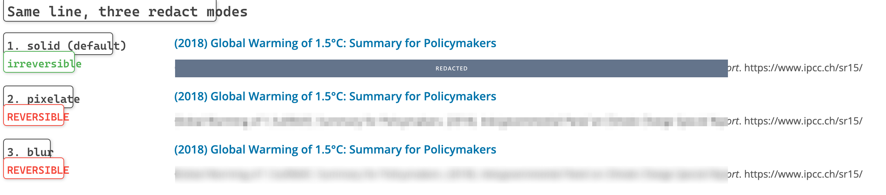
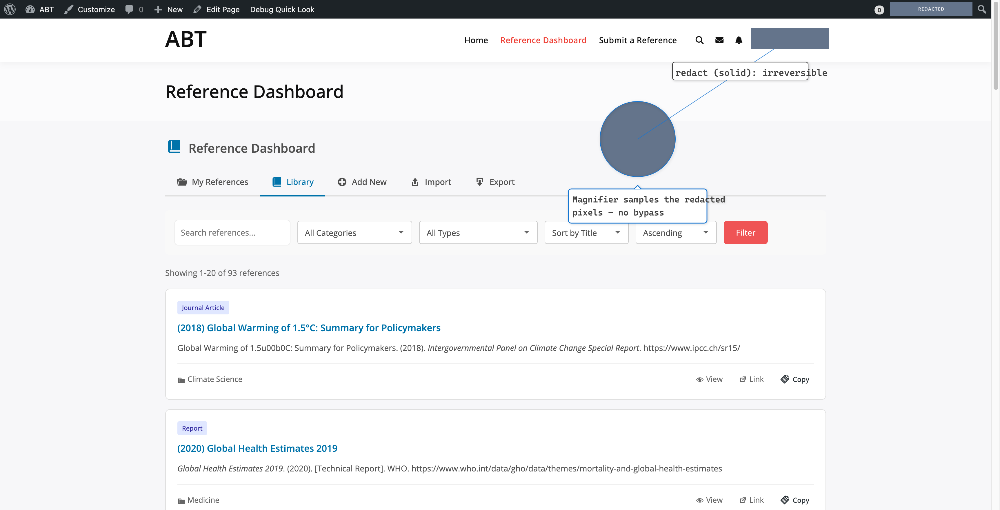

# 图片标注 MCP 服务器

专业的 MCP（模型上下文协议）服务器，用于为截图添加标记、箭头、标注等标注。支持与 Playwright MCP 无缝集成，适用于文档工作流。


## 功能特性

- **多种标注类型**：标记、箭头、标注框、矩形、圆形、标签、高亮、模糊、连接线和图标
- **专业样式**：紧凑的数字标记配白色描边环、可自定义颜色和主题
- **主题支持**：文档、教程、错误报告、高亮等预设主题
- **5 个 MCP 工具**：标注、尺寸获取、步骤指南、重新标注辅助和配置 UI
- **混合分发模式**：支持 MCP 服务器、命令行工具 (CLI) 和可移植 Skills 包

## 安装

### 方式一：使用 npx（推荐，无需安装）

```json
{
  "mcpServers": {
    "image-annotator": {
      "command": "npx",
      "args": ["-y", "image-annotator-mcp"]
    }
  }
}
```

### 方式二：全局安装

```bash
npm install -g image-annotator-mcp
```

```json
{
  "mcpServers": {
    "image-annotator": {
      "command": "image-annotator"
    }
  }
}
```

### 方式三：本地开发

```bash
cd image-annotator-mcp
npm install
```

```json
{
  "mcpServers": {
    "image-annotator": {
      "command": "node",
      "args": ["${process.cwd()}/server.js"]
    }
  }
}
```

> 注意：Windows 上请使用正斜杠或环境变量 `%CD%`。

### 方式四：Skills 包（适用于编程智能体）

将 `skills/image-annotator/` 复制到您的智能体 skills 目录。
详见 `skills/image-annotator/references/portability.md`。

## MCP 工具

### `annotate_screenshot`
为截图添加多个标注。

支持位图输出（`png`、`jpeg`、`webp`、`avif`）以及标注层 `svg` 输出。还支持 `redact_patterns`，用正则匹配标注文本并以实心矩形遮盖——**遮的是标注自身的文本框（含安全余量），不是截图底图中的原始内容**；不做 OCR；`svg` 输出下不可用。

**标注类型：**
- `marker` - 带白色描边环的小号数字圆点；省略 `number` 时按数组顺序自动从 1 递增。传入元素外框 `target: [x, y, width, height]` 可让标记贴在控件**旁边**而不是压在上面
- `arrow` - 直线或折线箭头（`lineStyle`），可在任一端或两端画箭头（`heads`）
- `curved-arrow` - 平滑曲线箭头
- `callout` - 带指针的文字框（气泡标注）；设置 `width`/`maxWidth` 后自动换行
- `rect` - 矩形高亮
- `circle` - 圆形高亮
- `ellipse` - 椭圆圈选（中心点 + `rx`/`ry`），适合圈宽扁的 UI 区域
- `polyline` / `polygon` - 开放/闭合的多点折线与多边形（`points: [[x,y],...]`）
- `freehand` - 经过点列的自由画笔
- `label` - 带可选背景的文字标签（`maxWidth` 自动换行）
- `highlight` - 半透明覆盖层
- `redact` - 遮盖区域（详见下方"打码"）
- `blur` - 已弃用，等价于 `redact` 的 `mode: "blur"`（可逆的视觉弱化，不是隐私保护）
- `connector` - 元素间的虚线连接
- `icon` - 图标徽章（check、x、warning、info、question、lock、star、cursor、thumbs-up、thumbs-down、plus、minus、eye），或直接传任意 emoji 字符
- `measure` - 带刻度线的尺寸标注；省略 `text` 自动显示两点距离
- `leadout` - 折线引出标注（目标圆点 + 标签芯片）
- `bracket-label` - 方括号或花括号（`bracketStyle`）分组标注
- `spotlight` - 暗色遮罩挖洞聚焦
- `magnifier` - 目标区域的圆形放大镜

**顶层选项：** `crop`（按原图坐标裁剪后再标注）、`background`（CleanShot 风格出图卡片：留白 + 圆角 + 投影 + 纯色/渐变背景）、`auto_layout`（可选的 leadout/callout/marker 避让）、`active`（只保留当前步骤的强调色）、`canvas_padding`、`device_pixel_ratio`、`sketch`、`redact_patterns`。

### 在密集页面上做编号

在信息密度高的界面上直接丢编号圆点，会把它们本该指向的控件盖住。下面三件事可以叠加使用：

```json
[
  {"type": "marker", "target": [262, 96, 210, 30]},
  {"type": "marker", "target": [486, 96, 96, 30]},
  {"type": "marker", "target": [236, 190, 18, 18]}
]
```

- **`target: [x, y, width, height]`** —— 元素的外框（Playwright 的 `boundingBox()` 可以直接传进来）。标记会自动放到框**外侧**，并画一条发丝引线连回去，18px 的复选框也不会被遮住。`width`/`height` 可省略。
- **`attach`** —— 放哪一侧：`left`、`right`、`top`、`bottom`、`auto`（给了 `target` 时的默认值，优先靠左成列，靠近画布左边缘时翻到右侧），或 `none` 表示按旧行为压在目标中心。
- **`auto_layout: true`** —— marker 现在也参与避让：有 `target` 的会尝试换一侧，只有 `x`/`y` 的会沿八个方向外移。
- **`active: 5`** —— 除第 5 个以外的标记全部降为中性石板灰，整张图带着完整序列时视线仍有落点。
- **`style: "ghost"`** —— 淡色填充 + 同色描边和数字，适合需要很多编号的安静序列；需要浅色背景才够清晰。

**主题：** `documentation`、`tutorial`、`bugReport`、`highlight`、`sketch`

**颜色：** red, orange, yellow, green, blue, purple, pink, cyan, teal, white, black, gray, lightGray, darkGray, success, warning, error, info, primary, secondary, accent

### 打码（Redaction）

```json
{"type": "redact", "x": 100, "y": 100, "width": 200, "height": 24, "label": "已隐去"}
```

三种模式的保证完全不同：

| 模式 | 可逆？ | 绘制位置 | 用途 |
|------|--------|----------|------|
| `solid`（默认） | **不可逆**——输出中该区域就是纯色填充 | 所有标注之上 | 敏感内容 |
| `pixelate` | **可逆**——块均值可被 Depix 类攻击还原 | 底图上、标注之下 | 仅视觉弱化 |
| `blur` | **可逆**——高斯模糊是可逆卷积 | 底图上、标注之下 | 仅视觉弱化 |

默认填充色为 `#64748B`（slate 中间调）：比黑条柔和，同时和白色页面、深色导航栏都拉得开距离。`color` 可换成任意颜色——所有纯色填充的不可逆性完全一样。

由此而来的规则：

- **只有 `solid` 是打码。** `pixelate`/`blur` 每次使用都会产生警告；不存在"调大参数就安全"的模糊。
- **层序差异是有意设计**：`solid` 遮盖其下的一切（包括其他标注）；`pixelate`/`blur` 作用于底图，标注仍绘制在其上。
- **`svg` 输出无法打码**——它是不含图像像素的标注层。手放的 redact 产生警告；`redact_patterns` 命中时直接报错（匹配文本会以原文存在于文件中）。请改用 `png`/`jpeg`/`webp`。
- **放大镜取样已打码的像素**：`magnifier` 指向打码区时显示填充色，不会泄漏原始内容。
- `redact_patterns` 遮的是**标注自身的文本框**（含安全余量），不是截图里的文字——工具不做 OCR。分享前请目视核查打码输出。

示例（用 `node examples/generate-redaction-example.js` 重新生成）：



*同一行文字的三种模式。只有 `solid` 真正销毁了内容，`pixelate` 与 `blur` 仍保留着词形轮廓。*



*放大镜直接对准打码区，它取样的是已打码的像素，无法用来把被遮内容放大展示出来。*

> ⚠️ **历史输出的信任说明**：v1.1.0 之前的 `blur` 只画了一层半透明灰色，内容清晰可辨且可完整还原。用旧版本"打码"过的截图请全部重新生成。详见 [CHANGELOG.md](CHANGELOG.md)。

### `get_image_dimensions`
获取图片的宽度、高度和格式。计算标注坐标的必备工具。

### `create_step_guide`
在截图上创建带数字的逐步指南。自动放置带标签的数字标记和连接箭头。

### `reannotate_screenshot`
按比例将现有的标注集重新映射到新的截图尺寸。这是针对缩放截图的辅助工具，而非视觉匹配。

### `open_config_ui`
打开基于浏览器的配置 UI 以自定义标注预设。传递 `working_directory` 以将 `.image-annotator.json` 保存到特定项目；否则默认为 MCP 服务器目录。

## 尺寸预设

工具会根据图片宽度自动调整标注尺寸。**标记尺寸是半径**，画出来的圆直径是表中数值的两倍：

| 预设 | 图片宽度 | 标记半径 | 圆直径 | 线条宽度 | 字体大小 |
|------|----------|----------|--------|----------|----------|
| xs   | < 400px  | 10px     | 20px   | 3px      | 12px     |
| s    | 400-800px| 12px     | 24px   | 4px      | 14px     |
| m    | 800-1200px| 14px    | 28px   | 5px      | 18px     |
| l    | 1200-1920px| 16px   | 32px   | 6px      | 22px     |
| xl   | > 1920px | 20px     | 40px   | 8px      | 28px     |

默认情况下，系统会根据图片宽度自动选择合适的预设。您也可以在配置文件中手动指定预设。

> 如果实际画出来的尺寸和上表对不上，多半是图片上方某处的 `.image-annotator.json` 设了 `defaultSizes`——见[配置文件](#配置文件)。那个文件的优先级高于这里的任何预设。

## 配置文件

在项目目录中创建 `.image-annotator.json` 文件以自定义默认设置：

```json
{
  "version": "1.0",
  "sizePreset": "auto",
  "theme": "documentation"
}
```

**配置查找顺序。** 查找从**输入图片所在目录**开始（不是进程的工作目录），找到第一个就停：

1. 输入图片自己的目录
2. 它的父级目录，最多 5 层
3. `~/.image-annotator.json`
4. 内置默认值

只会使用其中一个文件——不同层级找到的配置之间不会合并。

**`defaultSizes` 会覆盖尺寸预设。** 这是最容易踩到的一项：截图上方任意一级的配置文件，都能替它下面所有图片钉死标注尺寸，[尺寸预设](#尺寸预设)算出什么都不作数。

```json
{ "defaultSizes": { "markerSize": 44, "strokeWidth": 1, "fontSize": 20 } }
```

这里的 `markerSize: 44` 是半径，也就是每个标记都变成 88px 的圆——比最大的预设还大一倍多。优先级从高到低：

1. 标注自己的 `size` / `strokeWidth` / `fontSize`
2. 配置文件里的 `defaultSizes`（覆盖在预设之上，所以只写部分字段就只覆盖那几个）
3. `sizePreset` 指定的预设；为 `"auto"` 时按图片宽度自动选

想在单次调用里绕开它而不改文件，可以通过库 API 显式传入配置：

```js
await annotateImage(input, output, annotations, {
  config: { sizePreset: 'auto', theme: null, themes: null, defaultSizes: null }
});
```

> 本仓库根目录自带一个 `.image-annotator.json`，其中 `defaultSizes.markerSize: 44`、`theme: "tutorial"`。在仓库内标注任何图片都会读到它，因此除非显式覆盖，实际输出不会与文档里写的默认值一致。

## 配置 UI

使用 `open_config_ui` 工具在浏览器中打开可视化配置界面：

- 选择尺寸预设
- 选择配有专业字体的方案
- 自定义颜色和尺寸
- 实时预览

配置文件将保存到您传递给 `open_config_ui` 的 `working_directory`。如果省略，则默认为 MCP 服务器目录。

## 专业字体

每个主题都配有专业匹配的字体：

| 主题 | 字体系列 | 使用场景 |
|------|----------|----------|
| documentation | Inter | 技术文档 |
| tutorial | Nunito | 教程 |
| bugReport | JetBrains Mono | 错误报告 |
| highlight | Noto Sans | 多语言支持 |

## 使用示例

```json
{
  "input_path": "/path/to/screenshot.png",
  "annotations": [
    {"type": "marker", "x": 100, "y": 100, "number": 1, "color": "primary", "size": 28},
    {"type": "arrow", "from": [130, 100], "to": [200, 150], "color": "red", "strokeWidth": 3},
    {"type": "label", "x": 210, "y": 155, "text": "点击这里！", "background": "white", "shadow": true},
    {"type": "callout", "x": 300, "y": 200, "text": "重要！", "pointer": "left", "color": "orange"},
    {"type": "rect", "x": 50, "y": 250, "width": 200, "height": 100, "color": "green", "style": "dashed"},
    {"type": "icon", "x": 400, "y": 100, "icon": "check", "color": "success"}
  ]
}
```

## 与 Playwright MCP 配合使用

要获得准确的标注位置，请使用 Playwright 获取真实元素坐标：

### 步骤 1：导航和截图
```
browser_navigate → browser_take_screenshot
```

### 步骤 2：获取元素位置
使用 `browser_evaluate` 获取边界框：
```javascript
() => {
  const el = document.querySelector('[role="tab"]');
  const rect = el.getBoundingClientRect();
  return { x: rect.x, y: rect.y, width: rect.width, height: rect.height };
}
```

### 步骤 3：Retina（2倍）缩放
如果截图是 2 倍缩放，请将坐标乘以 2。

### 步骤 4：使用真实位置标注
```json
{
  "input_path": "/path/to/screenshot.png",
  "annotations": [
    {"type": "marker", "x": 1010, "y": 630, "number": 1, "color": "primary"},
    {"type": "callout", "x": 1010, "y": 500, "text": "点击这里", "pointer": "bottom"}
  ]
}
```

### 步骤 5：上传
将标注后的图片上传到 Basecamp：`basecamp_comment_with_file`

## 命令行使用

```bash
# 标注图片（位置参数模式）
node annotate.js input.png output.png --annotations '[{"type":"marker","x":100,"y":100,"number":1}]'

# 获取图片尺寸
node annotate.js dimensions input.png

# 重新映射标注（适用于缩放后的截图）
node annotate.js reannotate --new-screenshot new.png --previous-annotations '[...]' --previous-width 1280 --previous-height 720

# 创建步骤指南
node annotate.js step-guide input.png output.png --steps '[{"x":100,"y":200,"label":"点击这里"}]'

# 启动配置 UI
node config-ui/launch.js --working-directory /path/to/project
```

## 混合分发说明

- **MCP**：适用于 Claude Desktop 等 MCP 客户端，提供即插即用的工具集成。
- **CLI**：适用于编程智能体和自动化脚本，支持灵活的命令行调用。
- **Skills**：适用于任何智能体环境的可移植指导包，包含完整的提示词和上下文。

## 许可证

MIT 许可证 - 详见 [LICENSE](LICENSE) 文件。

## 作者

Varun Dubey <varun@wbcomdesigns.com>
