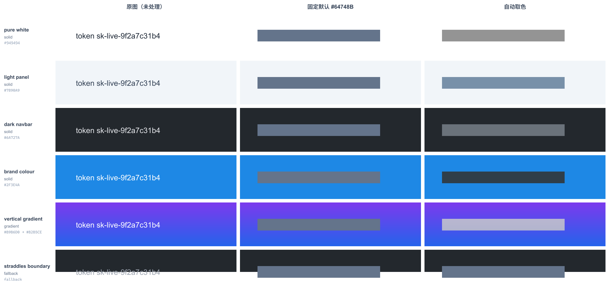

# 研究：按背景自动选择打码填充色

## 文档信息

- **项目**: image-annotator-mcp
- **日期**: 2026-09-05
- **状态**: 研究完成，**结论为暂不实施**。本文保留结论与参数，供将来实现 `color: "auto"` 时直接复用
- **相关**: [打码实施计划](../plans/2026-09-04-redaction-implementation.md)（阶段三 可选增强）
- **原型**: 已按决定清理，核心算法见本文第 5 节，据此可完整复现

## 1. 问题

`redact` 的 solid 模式当前使用固定填充色 `#64748B`。截图背景千差万别——纯白、深色导航栏、品牌色面板、渐变——固定色在某些背景上要么发闷，要么像贴纸。能否采样背景自动选一个更合适的颜色？

## 2. 安全前提（决定了实现方式）

**采样只能取打码区外圈，绝不能取区内。**

若填充色由区内像素算出（例如取区域均值），则颜色本身成为被遮内容的函数——内容的平均亮度会顺着填充色泄漏。这是一条隐蔽但真实的旁路。取外圈则完全安全：外圈本来就在输出中可见。

推论：**不透明渐变与不透明纯色一样不可逆**，只要渐变参数只来自区外。因此"渐变背景用渐变填充"是可以做的，不牺牲任何安全性。

## 3. 方法

在六种合成背景上，对同一段文字施加打码，比较固定色与自动取色：

- 外圈采样 12px，跳过区内像素，得到均值与标准差
- 标准差过大（跨明暗边界、复杂背景）→ 判定无法用单色概括，退回固定色
- 外圈上下四分位的均值差 > 18 → 判定为渐变，改出线性渐变填充
- 否则由均值推导单色：保留色相、压低饱和度、调整亮度直到满足对比度下限

## 4. 结果



| 背景 | 检测 | 自动色 | 对比度 | 与固定色相比 |
|---|---|---|---|---|
| 纯白 `#FFFFFF` | solid | `#949494` | 3.04 | 打平（固定色带色相反而更耐看） |
| 浅色面板 `#F1F5F9` | solid | `#7890A9` | 3.01 | **更好**，与面板冷调呼应 |
| 深色导航栏 `#23282D` | solid | `#6A727A` | 3.04 | 打平 |
| 品牌蓝 `#1E88E5` | solid | `#2F3E4A` | 3.00 | **明显更好**，固定色发闷 |
| 垂直渐变 紫→蓝 | **gradient** | `#B9B6D0 → #B2B5CE` | 2.94 / 2.77 | **明显更好**，固定色像贴纸 |
| 跨明暗边界（深/白各半） | **fallback** | `#64748B` | — | 正确退回，ringStd 110.0 |

**自动取色只在彩色与渐变背景上是明确赢面**，在最常见的纯白/深色背景上与固定色打平。这是"暂不实施"的主要依据。

## 5. 两个反直觉的坑（调参图上肉眼发现，非推导所得）

### 坑 1：亮度方向必须在候选筛选处约束，不能只控制遍历顺序

第一版用 `goDark = 亮度 > 0.35` 决定遍历方向，却按"最小满足对比度"选取。由于遍历仍覆盖整个亮度区间，方向标记实际无效——同一渐变的两端一个变亮、一个变暗。

修法：筛选时直接剔除方向错误的候选（`goDark ? l >= bgL : l <= bgL` → skip）。

### 坑 2：单向搜索会在中间调背景上"挖洞"

固定"往亮走"时，品牌蓝要满足 3.2:1 需一路推到接近纯白，视觉上像页面被挖了个洞。

修法：**两个方向都试，取亮度偏移更小的那个**。品牌蓝随即自动选择深色（`#2F3E4A`），观感正常。

### 最终参数

```
对比度下限        3.0:1     （2.2 太弱，深色背景上几乎看不见；3.6 在中间调背景上过冲）
饱和度            min(背景饱和度 × 0.55, 0.22)
外圈宽度          12px
渐变判定阈值      上下四分位均值差 > 18
退回固定色阈值    外圈标准差 > 42
渐变端点推导      由均值算出一次亮度偏移 dL，再套用到两端
                  （两端各自独立推导会被对比度规则normalise 成同色，抹平渐变）
```

## 6. 成本

- 整图 raw 解码：3450×1760 实测 **53ms/次**。多个打码区可共用一次解码，摊薄后可忽略。
- 实现风险：采样必须使用**加 padding 后的画布坐标**——与 magnifier 取样是同一个坑，实施计划 4.5 节已为此抽出 helper，新功能须遵循同一约定。

## 7. 结论与建议

**暂不实施。** 若将来实施，应满足：

1. 做成显式 opt-in 的 `color: "auto"`，默认仍为 `#64748B`，检测失败时也退回它。
2. 不做成默认：会让输出颜色依赖输入图，行为不可预测，并给测试引入不确定性。
3. 需补齐：坐标系对齐、多打码区共享一次解码、渐变走 SVG `linearGradient`（不透明）、以及一组固定背景的像素级测试（断言 `std === 0` 与退回逻辑）。
4. 安全红线不可动摇：采样绝不触及打码区内像素。
